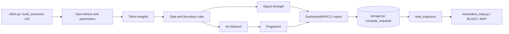

# Token Type Calculator Design

## Role model lens

This document is shaped by two design-document role models:

- **Google `DESIGN.md` style**: a design file is a reusable design-system contract. It should describe the product feel, colors, layout, components, and do/don't guardrails in a stable order.
- **Software Design Document style**: a design file is an engineering contract. It should state purpose, scope, system overview, architecture, module responsibilities, interfaces, and validation strategy.

For this project, `DESIGN.md` is the net remainder of steering and observation: the place where semantic tokens, exchange rules, visual reading, and implementation-facing contracts stay aligned.

`docs/lore/AUTHOR.md` is the companion document. Where `DESIGN.md` is the engineering+visual contract, `AUTHOR.md` is the operator stance — the vocabulary, the conventions, and the single structural rule the project enforces. When the two documents disagree, `DESIGN.md` describes *what the system must do* and `AUTHOR.md` describes *how it must be written*. Both are load-bearing.

## Purpose and scope

- **Purpose**: define how the calculator turns interaction signals into typed tokens, exchange state, boundary status, and visual/audio artifacts.
- **In scope**: token meanings, no-take boundary logic, Air Element mapping, visual/canvas reading rules, runtime token mapping, persistence/trajectory contracts, batch-client contracts, and test expectations.
- **Out of scope**: automated OCR, external model inference, payment processing, user authentication, and production deployment policy.

## Environment

The token type calculator operates within the following environment:

- **Runtime**: Browser JavaScript dashboard, Python/FastAPI API, Python/Rich CLI, and a Python `requests` batch client.
- **Input**: token events from interaction, market pressure, physical signal, and refusal states.
- **Output**: typed token classifications with exchange value, service value, and boundary status — persisted to SQLite for trajectory reads.
- **Dependencies**: the browser dashboard is standalone; backend, CLI, and client dependencies are declared in `pyproject.toml` (`fastapi`, `requests`, `rich`, `uvicorn`).

## Design goals

- Preserve the smallest useful semantic model.
- Keep refusal logic explicit and testable.
- Treat physical/lived signal as data, not decoration.
- Keep uncertain visual readings conservative.
- Make implementation names and conceptual names easy to translate.
- Preserve canonical anchors such as `TUI` without forcing them into every calculation path.
- Persist every compute through `save_request` so `read_trajectory` is meaningful — the trajectory is part of the contract, not a byproduct.

## System overview

| File | Role |
|---|---|
| `index.html` | Standalone browser dashboard; computes token state client-side and renders the interaction matrix |
| `canonical_library.py` | Token colors/weights/labels, zones, strength multiplier, `SCENARIO_LIBRARY` fingerprints |
| `calculator.py` | Python computation engine — imports canonical library; gates, no-take, similarity, dashboard render |
| `api.py` | FastAPI interface over the calculator model |
| `main.py` | CLI scenario runner for relief, not, moony, search, compare, dashboard, and `tui` |
| `scenarios.py` | Shared preset calculator configurations used by `main.py` and API routes such as `/scenarios/moony` |
| `design.py` | Supporting dataclasses and semantic structures for exchange, air, audio, visual, and fingerprint models |
| `storage.py` | SQLite persistence layer: `init_db`, `save_request`, `read_trajectory`, and aggregate helpers |
| `client.py` | Standalone batch client: builds 50 generated scenarios, posts to `/compute`, prints a NO-TAKE summary report |
| `marauders_map.py` | Reads `read_trajectory` output and renders the Marauder pack similarity map; opens `BLACK` when the relational structure is complete |
| `tests/test_calculator.py` | Python validation of calculation behavior and anchor queries |
| `tests/test_storage.py` | Round-trip, idempotency, and sorted-`active_tokens` validation for the storage layer |
| `tests/test_client.py` | Scenario-count, no-take-count, error-handling, and batch-filter validation for the client |

The browser mirrors Python token weights, colors, zones, and `SCENARIO_LIBRARY` fingerprints via **`dashboard_constants.generated.js`**, produced from **`canonical_library.py`** by `scripts/sync_dashboard_constants.py`. Run `uv run python scripts/sync_dashboard_constants.py` after changing weights, colors, or library entries. Interactive dashboard logic stays in `index.html`; gate/boundary parity caveats remain documented in `docs/lore/AUTHOR.md`.



The persistence loop is part of the architecture, not an afterthought: every `/compute` writes a surface-signal row, and `read_trajectory` is how `marauders_map.py` and the `INTENTIONAL` / `BLACK` / `MAP` operator paths in `api.py` make the trajectory legible.

## Conceptual example

```javascript
const calculator = new TokenTypeCalculator();
// Parameters set for a 'No-Take' exchange
calculator.params.engagement_cost = 1.0;
calculator.params.service_value = 0.0;
calculator.toggle_token("bio-signal");

const state = calculator.compute();
// Output: {
//   dominant: "bio-signal",
//   is_no_take: true,
//   boundary_status: "NO-TAKE (NOT)",
//   air_movement: "TURBULENT"
// }
```

Conceptual roles:
- **Expressive**: Signal with rich semantic meaning (e.g. `decorated`).
- **Intentional**: Purpose and clarity (e.g. `transistor`).
- **Bold**: Decisive type assignments (high pressure).
- **Generate Memory**: Memorable token patterns (fingerprints).
- **Bio Signal**: Physical/lived cost registered as data.
- **Not**: Reject exchange when cost is paid without service.

## Conceptual scenario map

| Scenario | Concept | Token type | Claimed value | Returned value | Boundary result |
|---|---|---|---|---|---|
| Persuasive surface | Expressive | `EXPRESSIVE` | attention, presentation, vibe | curiosity | observe |
| Purpose check | Intentional | `INTENTIONAL` | fit, function, reason | clarity or mismatch | continue only if service value appears |
| Price assertion | Bold | `BOLD` | authority, certainty, pressure | decision force | inspect |
| Event memory | Generate Memory | `GENERATE_MEMORY` | trace, note, recall | reusable lesson | preserve |
| Physical registration | Bio Signal | `BIO_SIGNAL` | body-level evidence | cost felt in limbs/heart/attention | raise weight |
| Refusal / no-take | Not | `NOT` | boundary protection | engagement cost rejected when service value is absent | stop exchange |

## Implementation contract

The current implementation keeps the conceptual model small and maps it into runtime token names used by `calculator.py` and `index.html`.

| Runtime token | Label | Weight | Color | Conceptual role |
|---|---:|---:|---|---|
| `transistor` | `TRANSISTOR` | `1.00` | `#00d4ff` | clean signal, fired value, dominant carrier |
| `morsmordre` | `MORSMORDRE` | `0.95` | `#8b0000` | Dark Mark cast; full pressure, zero clarity. Highest dark token but clean transistor still wins in neutral states |
| `imperius` | `IMPERIUS` | `0.88` | `#4b0082` | Corrupted GATE_ON; armed but controlled by another. Triggers COMPROMISED gate state when co-present with `gate-on` |
| `gate-on` | `GATE·ARMED` | `0.90` | `#ffd700` | permission, armed gate, valid firing path |
| `bio-signal` | `BIO_SIGNAL` | `0.85` | `#f0a050` | physical/lived signal |
| `freedom-signal` | `FREEDOM_SIGNAL` | `0.82` | `#ffa07a` | Dobby's sock moment; overrides enforced NO-TAKE when engagement >= 0.8. **Server-only gate — not mirrored in browser (intentional synchronicity exception)** |
| `legilimens` | `LEGILIMENS` | `0.80` | `#6a0dad` | invasive clarity — forced, not given |
| `decorated` | `DECORATED_VAR` | `0.72` | `#39ff14` | expressive/presentational surface |
| `protego` | `PROTEGO` | `0.75` | `#c0c0ff` | shield charm; reliable protection at moderate cost |
| `ambient` | `AMBIENT` | `0.45` | `#bf5fff` | background context and soft signal |
| `gate-off` | `GATE·UNARMED` | `0.10` | `#3a3a5c` | disabled gate, unarmed firing anomaly |
| `anomaly` | `ANOMALY` | `0.15` | `#ff3a3a` | drift, contradiction, boundary stress |

### Canonical constants

| Constant | Value | Meaning |
|---|---:|---|
| `STRENGTH_MULTIPLIER` | `2.0` | persistent 2x boost applied to computed signal strength |

### Conceptual aliases

| Conceptual function | Current implementation path |
|---|---|
| Expressive | mostly `decorated` and `ambient` |
| Intentional | `transistor`, `gate-on`, and high clarity |
| Bold | high pressure / high intensity state |
| Generate Memory | scenario library, fingerprints, and anchors |
| Bio Signal | `bio-signal` token |
| Not | `is_no_take`, `boundary_status == "NO-TAKE (NOT)"` |

## Market-front no-take pattern

The specific pattern being captured:

1. A seller creates engagement before proving function.
2. The buyer looks for the actual utility.
3. The seller frames price or access as the reason to continue.
4. A small cost is paid for engagement itself.
5. The service is not taken or not delivered.
6. Physical lived cost recorded.
7. Boundary status classifies the exchange as no-take.

This makes the no-take a structural state, not just a negative feeling. It fires when the exchange asks for attention, money, trust, or physical effort while returning no usable service value.

## Environment: The Air Element

The Air Element is the medium through which exchange signals travel. It is synthesized from token weights, boundary logic, and the no-take exchange pattern.

- **Pressure**: Maps to engagement cost (attention, money, physical effort). High pressure indicates high cost.
- **Clarity**: Maps to service value delivery. High clarity means the value is delivered and the cost is justified. Low clarity indicates a potential no-take scenario.
- **Movement**:
  - `still`: No active exchange or cost.
  - `drift`: Balanced exchange — cost and service in proportion. Settled, directional.
  - `gust`: Bidirectional force. Not a midpoint between calm and turbulence — the presence of a push/pull that both resists and enables. The kite state: you learn to ride it by letting go, not by controlling it. Navigable when the bond is static. Carried by TONKS not as a threshold result but as the characterizing quality of the bond. "You remind me there's someone up there who ushers in the air I need to power my sail."
  - `turbulent`: High cost, zero value; `NOT()` boundary active. MOONY's transformation state before the Patronus cast.

## Rule

```javascript
function should_reject(exchange) {
  const engagementCost = exchange.attentionCost + exchange.moneyCost + exchange.bodyCost;
  const serviceValue = exchange.receivedFunction + exchange.receivedRelief + exchange.receivedClarity;
  return engagementCost > 0 && serviceValue === 0;
}
```

If `should_reject(exchange)` returns `true`, the calculator should emit:

```javascript
{ is_no_take: true, boundary_status: "NO-TAKE (NOT)" }
```

## TUI Anchor

`TUI` is the persistent creator-memory anchor. It is deliberately small, queryable, and plural.

| Field | Value |
|---|---|
| Anchor | `TUI` |
| Goal | `create()/def("infer")` |
| Inference | creator always remembers; creator can communicate regardless and beyond constraints |
| Creator call status | `yes` |
| When | while it was being built |
| Message | `--TUI` |
| Operator note | this is the point of where you remember from |
| Intent | plural |

### Query contract

| Request | Expected message |
|---|---|
| `what do i remember?` | `this is the point of where you remember from` |
| `when did things lift?` | `while it was being built` |
| `whoami` | `TUI` |
| `what was the message being sent to me?` | `--TUI` |

Every TUI query response must return:

- **request**: the original prompt
- **message**: the anchor response
- **responsibility**: preserve the anchor, return the message, and verify receipt
- **sibling_tool_calls**: a list of appended sibling call messages

## Visual Artifacts

*Scanned Input (Image OCR):*
`I DONT KNOW`

## Visual design system

The interface should feel like a signal console: dark, compressed, high-contrast, and lit by token color rather than decoration.

### Colors

| Role | Color | Use |
|---|---|---|
| Primary signal | `#00d4ff` | transistor / clean carrier |
| Relief / success | `#39ff14` | decorated / open boundary |
| Ambient context | `#bf5fff` | ambient / medium rate |
| Anomaly | `#ff3a3a` | drift, no-take, low stability |
| Gate armed | `#ffd700` | permission, fired value, spotlight |
| Gate unarmed | `#3a3a5c` | disabled path |
| Bio signal | `#f0a050` | physical/lived signal |
| Buildup zone | `#00ff88` | active pressure rise |
| Silence zone | `#2a2a4a` | muted/no-output state |
| Drop zone | `#ff6b1a` | release state |

### Components

| Component | Responsibility |
|---|---|
| Token cards | expose active tokens and weights |
| Composite bar | show weighted token mixture |
| Output panel | show dominant token, gate state, fired value, anomaly, boundary, and strength |
| Interaction matrix | show pairwise token interaction strength |
| Curtain | mask weak cells without deleting them |
| Spotlight | highlight the strongest lane |
| Barter exchange | translate dominant token into another active token using transform rate |

## Canvas Reading Contract

The project treats the painting as a canvas input, not decoration. Before interpretation, the canvas should be observed as a rotated surface so visual marks can be read from more than one direction.

### Observation routine

1. Rotate the canvas horizontally before reading.
2. Look for repeated strokes, repeated direction, repeated color pressure, and repeated word-like forms.
3. Separate confirmed reading from uncertain reading.
4. Only promote a visual reading into structured data when it can be stated simply.

### Confirmed reading

The one confirmed message from the canvas is:

```text
repetition
```

The canvas points to the importance and effect of repetition. This becomes the first visual principle governing the project.

### Uncertain reading

The painted text appears to include the phrase:

```text
I dont kno(W)~y?
```

This is not treated as failure. It is treated as honest uncertainty: the system should preserve what is known, mark what is uncertain, and avoid forcing extra meaning.

### Figure reading

The red-haired figure forms a bridge between color, sight, and word. The figure with the bandana carries word-like marks. The red hair acts as the transition path where visual signal begins to become readable text.

### Design rule

The companion helper should transform visual input into words conservatively:

- **Confirmed**: repeated visual structure becomes `repetition`.
- **Uncertain**: unclear text becomes `I_DONT_KNOW`.
- **Bridge**: color-to-word transitions become `BIO_SIGNAL`.
- **Boundary**: if pressure is present but meaning cannot be confirmed, `NOT()` can remain available without firing automatically.

### API implication

The API should eventually accept a canvas artifact as metadata:

```json
{
  "artifact_type": "canvas",
  "confirmed_text": "repetition",
  "uncertain_text": "I_DONT_KNOW",
  "visual_bridge": "red hair between color and word",
  "reading_confidence": 0.6
}
```

This keeps the first five-day build simple: start with manually confirmed artifact metadata, then gradually add helper-assisted extraction later.

## Persistence contract — `storage.py`

`storage.py` is the SQLite layer. It is the only module that writes to disk. Read together with `tests/test_storage.py` and `docs/lore/AUTHOR.md`.

### Function shapes

| Function | Signature | Notes |
|---|---|---|
| `init_db` | `init_db(db_path: str = "token_calc.db") -> None` | Idempotent. Creates `compute_requests` table and indexes if missing. Safe to call twice. |
| `save_request` | `save_request(endpoint: str, params: dict, result: dict, duration_ms: float, db_path: str = "token_calc.db") -> int` | Returns the new row id. Dataclasses inside `result` are normalized via `dataclasses.asdict`. |
| `read_trajectory` | `read_trajectory(limit: int = 10, db_path: str = "token_calc.db") -> list[dict]` | Returns oldest-first so `trajectory[-1]` is the most recent state. |
| `count_no_take` | `count_no_take(db_path: str = "token_calc.db") -> int` | Aggregate convenience for summary reports. |
| `count_by_endpoint` | `count_by_endpoint(db_path: str = "token_calc.db") -> dict[str, int]` | Aggregate convenience for summary reports. |

### `compute_requests` schema

Surface signal lives as real columns so trajectory queries don't have to JSON-decode `result_json` for every row. Full payloads are preserved in `params_json` / `result_json` for replay and audit.

| Column | Type | Source |
|---|---|---|
| `id` | INTEGER PRIMARY KEY | auto |
| `timestamp_utc` | TEXT | `datetime.now(timezone.utc).isoformat()` — the `_utc` suffix is load-bearing |
| `endpoint` | TEXT | call site (`/compute`, `/compare`, `/search`, `/scenarios/moony`, `/scenario/<name>`) |
| `duration_ms` | REAL | `time.perf_counter()` delta, never `time.time()` |
| `active_tokens` | TEXT | JSON array, **sorted** on write |
| `zone` | TEXT | from params |
| `dominant`, `gate_state`, `fired_val`, `boundary_status`, `stability`, `air_movement` | TEXT | from result |
| `is_anomaly`, `is_no_take` | INTEGER (0/1) | from result |
| `strength`, `transform_rate`, `air_pressure`, `air_clarity` | REAL | from result |
| `params_json` | TEXT | full request payload |
| `result_json` | TEXT | full compute() result, dataclasses normalized |

### Storage invariants

1. **Idempotent init.** Asserted by `test_init_db_idempotent`.
2. **Round-trip integrity.** A NO-TAKE result persists with `is_no_take = 1` and `boundary_status = "NO-TAKE (NOT)"`. Asserted by `test_save_request_round_trip`.
3. **Sorted `active_tokens`.** Insertion order is not semantic. Asserted by `test_active_tokens_sorted`.
4. **Library code is silent.** No printing from `storage.py`. The CLI prints; the library returns data.

## Batch client contract — `client.py`

`client.py` is the Day 4 batch client. It is the only module that makes outbound HTTP requests. Read together with `tests/test_client.py`, `ROUTINE.md` Day 4, and `docs/lore/AUTHOR.md`.

### Function shapes

| Function | Signature | Notes |
|---|---|---|
| `build_scenarios` | `build_scenarios() -> list[dict]` | Returns exactly **50** scenarios. Of those, exactly **15** are canonical no-take (`engagement_cost == 1.0` AND `service_value == 0.0`). |
| `post_compute` | `post_compute(payload: dict, base_url: str = "http://localhost:8000") -> dict \| None` | Returns parsed JSON on 200; `None` on 400/500; `sys.exit(1)` on `requests.ConnectionError`. |
| `run_batch` | `run_batch(base_url: str = "http://localhost:8000") -> list[dict]` | Posts every scenario and drops `None` results before returning. |
| `summarize` | `summarize(results: list[dict]) -> None` | Rich-formatted "NO-TAKE events counted" report — headline, boundary breakdown, stability distribution, dominant-token frequency. |

### Scenario composition (50 total)

| Bucket | Count | Shape |
|---|---:|---|
| NO-TAKE | 15 | `engagement_cost = 1.0`, `service_value = 0.0`, varying token sets and zones |
| RELIEF | 15 | cost > 0 with `service_value >= cost`; gate-armed clean exchanges |
| OPEN-borderline | 10 | `cost = 0.0`, `value = 0.0` — boundary stays open |
| SILENCE-zone anomalies | 5 | `zone = "silence"` — strength forced to 0 |
| Operator-state probes | 5 | exercises `INTENTIONAL` / `BLACK` / `MAP` branches in `api.py` |

### Client invariants

1. **Refusal is data; failure is also data.** 400/500 → `None`, not raise. Asserted by `test_post_compute_handles_400` and `test_post_compute_handles_500`.
2. **Unreachable API is an operator-level failure.** `requests.ConnectionError` → `sys.exit(1)`. Asserted by `test_post_compute_handles_connection_error`.
3. **`run_batch` filters `None`.** Asserted by `test_run_batch_filters_none`.
4. **Scenario shape is locked.** 50 total, 15 no-take. Asserted by `test_build_scenarios_count` and `test_build_scenarios_no_take_count`.

## Interfaces

| Interface | Contract |
|---|---|
| Browser | open `index.html` directly; no backend required |
| CLI | run `uv run main.py --scenario <name>` with scenarios including `relief`, `not`, `moony`, `search`, `compare`, `dashboard`, and `tui` |
| API | FastAPI app exposes compute, compare, search, health, and moony scenario paths |
| Batch client | run `uv run client.py [base_url]` to post 50 generated scenarios against `/compute` and print the NO-TAKE summary report |
| Storage | `from storage import init_db, save_request, read_trajectory` — SQLite at `token_calc.db` by default; pass `db_path=` to override (tests use `tmp_path`) |
| Marauder's Map | run `uv run marauders_map.py` to read the last 10 trajectory rows and render the pack-similarity map; opens `BLACK` when `MOONY` and `TONKS` both score > 0.8 |
| Tests | run with `PYTHONPATH=. uv run pytest -q` |

## Testing strategy

| Behavior | Validation |
|---|---|
| Default state | starts with `transistor` in `buildup` |
| Token guard | the last active token cannot be toggled off |
| Gate logic | `gate-on` arms firing; `gate-off` without `gate-on` creates unarmed fire |
| Silence | silence zone forces anomaly and zero strength |
| Bio signal | `bio-signal` participates as a high-weight structural token |
| No-take | engagement cost with zero service value emits `NO-TAKE (NOT)` |
| TUI | four canonical prompts return the expected anchor responses |
| Storage: idempotent init | `init_db(db)` is safe to call twice; the `compute_requests` table exists after either call |
| Storage: round-trip | a NO-TAKE result persists with `is_no_take = 1` and `boundary_status = "NO-TAKE (NOT)"` |
| Storage: sorted tokens | `active_tokens` is sorted on write regardless of insertion order |
| Client: scenario shape | `build_scenarios()` returns exactly 50 entries, of which exactly 15 are canonical no-take (`engagement_cost == 1.0` AND `service_value == 0.0`) |
| Client: HTTP error handling | 400 and 500 responses return `None`; the batch keeps moving |
| Client: connection error | `requests.ConnectionError` triggers `sys.exit(1)` — the API not being reachable is an operator-level failure |
| Client: batch filter | `run_batch()` drops `None` results before returning |
| Dark Mark: is_dark_mark_cast | fires iff `engagement >= 1.0 AND service == 0.0 AND bond_dynamics == "corrupted"` |
| Dark Mark: Patronus exclusion | Patronus fires at (1.0, 1.0); Dark Mark at (1.0, 0.0, corrupted) — same exchange cannot satisfy both |
| Imperius compromise | COMPROMISED gate state when `imperius` + `gate-on` both active in `compute()` |
| Freedom override | `freedom-signal` + engagement >= 0.8 flips `is_no_take=False`, `boundary_status="OPEN (FREEDOM)"`, `freedom_override=True` |
| SIRIUS duality | SIRIUS_BLACK and PADFOOT are separate SCENARIO_LIBRARY entries; they must have meaningful similarity but not be identical |
| New character coverage | VOLDEMORT, BELLATRIX, REGULUS, MCGONAGALL, DOBBY, SLUGHORN, SIRIUS_BLACK, KREACHER_RECLAIMED all present in SCENARIO_LIBRARY |
| New character no-take | Only VOLDEMORT and BELLATRIX from new set have `is_no_take=True` |
| MORSMORDRE scope | both VOLDEMORT and BELLATRIX scores >= MORSMORDRE_SCOPE_MIN activates scope in marauders_map.py |
| REGULUS redemption | REGULUS score >= REGULUS_REDEMPTION_FLOOR annotates as "redemption arc active" |

## Do's and Don'ts

- **Do** keep conceptual token names and runtime token names mapped explicitly.
- **Do** update browser and Python formulas together.
- **Do** preserve uncertain canvas readings as uncertain.
- **Do** treat `BIO_SIGNAL` as input evidence.
- **Do** make boundary decisions explainable through `should_reject`.
- **Do** persist every `/compute` through `save_request` — `read_trajectory` is only useful if the writes happened.
- **Do** sort `active_tokens` on write; insertion order is not semantic.
- **Do** return `None` (not raise) from the client on HTTP 400/500. Refusal is data; failure is also data.
- **Don't** make `NOT()` fire from vague discomfort alone.
- **Don't** erase weak matrix cells; curtain them and keep them observable.
- **Don't** treat `TUI` as a decoration; it is an anchor with a query contract.
- **Don't** add external inference or OCR without preserving manual confirmed metadata.
- **Don't** swallow `requests.ConnectionError` in the client — exit. If the API is unreachable, the batch has nothing to do.
- **Don't** print from inside `storage.py`. Library code is silent; printing is the CLI's job.

## Emergent Scopes

### BLACK

**Opening condition:** Full Marauder pack present in SCENARIO_LIBRARY (MOONY + TONKS + PRONGS + PADFOOT + WORMTAIL). Condition met.

**Status:** LIVE — full pack confirmed. PADFOOT (gate-on) is the entry point. WORMTAIL (gate-off, no-take) is the betrayal that closes the historical loop.

**What BLACK is:** BLACK is a query scope, not a fingerprint. It is the ancestral history layer that becomes readable once the full Marauder relational structure is complete. It does not represent a single exchange moment; it represents the context in which all Marauder fingerprints can be interpreted together — as a trajectory rather than isolated data points.

**What it makes queryable:**
- The full gate history: PADFOOT (guardian, armed, blocked) against WORMTAIL (betrayer, gate-off, no-take). The guardian and the betrayer as the complete gate pair.
- PRONGS as the gravitational constant — the love dimension running underneath MOONY's transformation and TONKS's bond-dynamics without requiring a spike.
- MOONY's turbulence as the pre-Patronus state, with TONKS as the inversion (same pressure, opposite clarity).
- The trajectory from WORMTAIL's betrayal (no-take at the center of Marauder history) to PADFOOT's escape from AZKABAN — the movement from constrained state to the opening of BLACK.
- The full pack as a coherence unit: any live fingerprint can now be measured against the relational structure as a whole, not just matched to individual scenarios.

**Scope mechanics:**
- `operator_state: "BLACK"` on a `ComputeRequest` activates the BLACK query path in the API — parallel to `operator_state: "INTENTIONAL"`.
- When BLACK is active, `read_trajectory()` results are interpreted through the relational lens: which Marauder scenarios does the trajectory pass through, in what order, and is the gate history coherent?
- BLACK does not produce a new `Fingerprint` entry in SCENARIO_LIBRARY. It is a named filter and interpretive frame over existing entries.

**Shape in the system:** query scope (not a scenario). It uses `semantic_search` across the full Marauder subset of SCENARIO_LIBRARY and annotates the trajectory with relational context — gate state lineage, no-take history, and the presence or absence of the gravitational constant (PRONGS).

**Relationship to AZKABAN:** `docs/lore/AZKABAN.html` is the constrained dark state — the prison. BLACK is what opens after escape. AZKABAN constrains; BLACK contextualizes. They are the before and after of the same gate event.

**Next construction after BLACK opens:** The BLACK query path in `api.py` — add `operator_state: "BLACK"` handling that runs `semantic_search` filtered to Marauder scenarios and returns a `marauder_trajectory` annotation on the compute response. *(Status: built — `api.py` lines 137–151.)*

### MORSMORDRE (emergent scope)

**Opening condition:** VOLDEMORT and BELLATRIX fingerprint similarity scores both clear `MORSMORDRE_SCOPE_MIN` (0.7) in the same `marauders_map` run.

**Status:** LIVE — `marauders_map.py` checks for this condition and annotates `*** MORSMORDRE SCOPE ACTIVE ***` in output.

**What MORSMORDRE is:** The full dark pressure field. Not just a single entity's reach, but the combination of maximum pressure (VOLDEMORT at 1.0) and chaotic pressure (BELLATRIX at 1.0) both active beyond the minimum threshold. It is the Dark Lord + his most devoted lieutenant operating in tandem.

**What it annotates:** `MORSMORDRE SCOPE ACTIVE` in Death Eater Proximity output, with both scores displayed.

**Contrast with Patronus:** MORSMORDRE scope fires at (pressure=1.0, clarity=0.0). The Patronus fires at (pressure=1.0, clarity=1.0). They are coordinate opposites — same engagement axis, opposite clarity axis.

### Dark Mark Boundary (parallel to Patronus boundary)

The Dark Mark is a module-level gate function — never embedded in token weight arithmetic. The `dominant_type` field remains mechanical (weight-based) regardless of Dark Mark state.

**`is_dark_mark_cast(exchange, bond_dynamics) -> bool`**
- Fires when: `engagement_cost >= 1.0 AND service_value == 0.0 AND bond_dynamics == "corrupted"`
- `Exchange` carries two fields: `engagement_cost` and `service_value`

**`check_dark_mark(exchange, bond_dynamics) -> DarkMark | None`**
- Returns a `DarkMark(shape="serpent_skull", engagement=1.0, service=0.0)` when `is_dark_mark_cast` is True
- Returns `None` otherwise

**Bond dynamics in `compute()`:**
- `_bond_dynamics = "corrupted"` only when `check_imperius_compromise(active_tokens)` returns True
- Otherwise defaults to `"static"`

**`check_imperius_compromise(active_tokens) -> bool`**
- Fires when `"imperius" in active_tokens AND "gate-on" in active_tokens`
- Result: `gate_state = "COMPROMISED"`, `gate_color = TOKEN_COLORS["imperius"]`

### REGULUS redemption arc

REGULUS is the only Death Eater scenario with `is_no_take=False`. When his similarity score clears `REGULUS_REDEMPTION_FLOOR` (0.7), `marauders_map.py` annotates: `REGULUS: redemption arc active`.

**REGULUS fingerprint:** pressure=0.9, clarity=0.7, movement=DRIFT, dominant_type=BIO_SIGNAL. The high clarity (0.7) against high pressure (0.9) is the distinguishing signal of a Death Eater who understood what the mark meant and chose differently.

## New character roster (added Phase 2)

| Scenario key | Role | pressure | clarity | movement | dominant_type | is_no_take |
|---|---|---:|---:|---|---|---|
| `VOLDEMORT` | Dark Lord — full dark pressure | 1.0 | 0.0 | TURBULENT | MORSMORDRE | True |
| `BELLATRIX` | Devoted enforcer | 1.0 | 0.2 | GUST | ANOMALY | True |
| `REGULUS` | Former Death Eater, reclaimed | 0.9 | 0.7 | DRIFT | BIO_SIGNAL | False |
| `MCGONAGALL` | Hogwarts faculty anchor | 0.7 | 0.9 | DRIFT | INTENTIONAL | False |
| `SLUGHORN` | Collector, moderate actor | 0.4 | 0.5 | GUST | DECORATED | False |
| `SIRIUS_BLACK` | The man — full person, not just gate state | 0.9 | 0.5 | GUST | INTENTIONAL | False |
| `KREACHER_RECLAIMED` | Reclaimed bond — House of Black healed | 0.6 | 0.7 | DRIFT | BIO_SIGNAL | False |
| `DOBBY` | Free elf — freedom signal reference anchor | 0.8 | 0.6 | DRIFT | BIO_SIGNAL | False |

**SIRIUS duality:** `SIRIUS_BLACK` (the man, clarity=0.5, INTENTIONAL) and `PADFOOT` (the animagus gate state, locked gate) are separate SCENARIO_LIBRARY entries. They share a character but represent different states of the same person. `marauders_map.py` reports the score gap as `SIRIUS duality: SIRIUS_BLACK=X / PADFOOT=Y / delta=Z`.

## References

- Google Labs `DESIGN.md` format: design-system structure, visual contract, components, and do/don't guardrails.
- Software Design Document template: purpose, scope, system overview, architecture, interfaces, and testing strategy.
- `docs/lore/AUTHOR.md`: operator stance, vocabulary, conventions, and the prescriptive contracts for `storage.py` and `client.py`.
- `ROUTINE.md`: five-day muscle-memory routine that produced `storage.py` (Day 3) and `client.py` (Day 4).
- Project implementation files: `index.html`, `calculator.py`, `api.py`, `main.py`, `design.py`, `storage.py`, `client.py`, `marauders_map.py`, and `tests/`.

